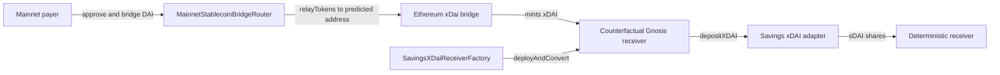
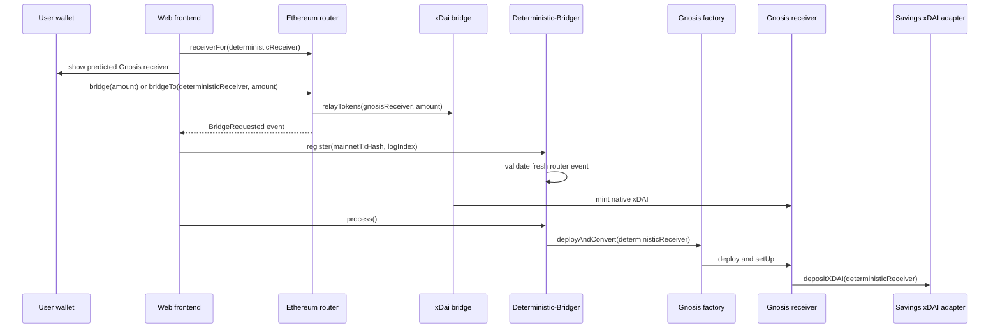
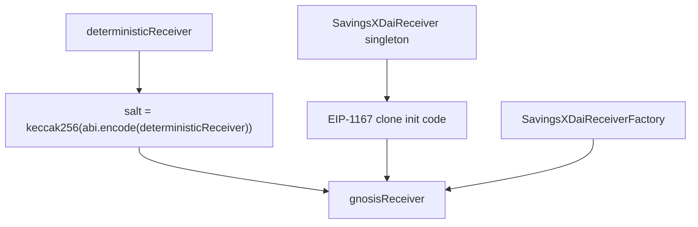
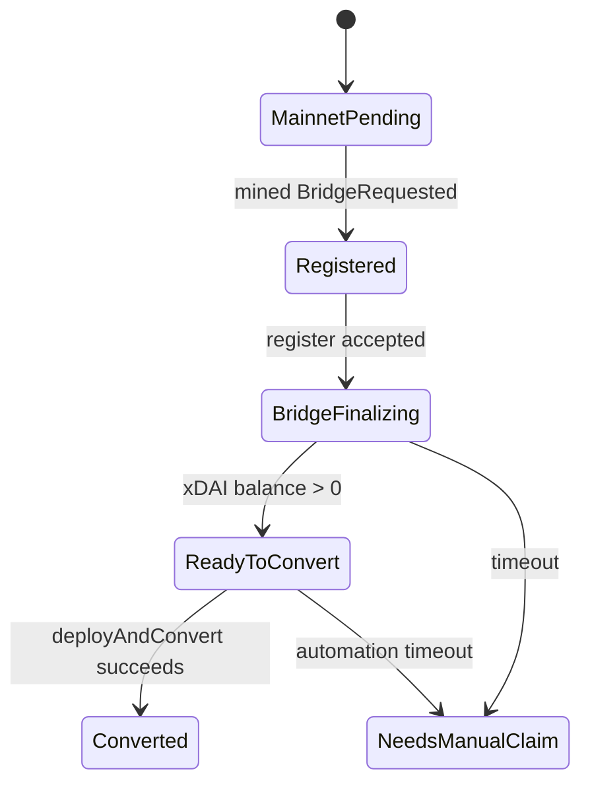

# Deterministic Bridger

Deterministic Bridger routes mainnet DAI through the canonical xDai bridge to a
counterfactual Gnosis receiver, then converts the bridged xDAI into sDAI for the
intended deterministic receiver.

The core idea is that the mainnet router and Gnosis factory share the same
`CREATE2` address derivation. A user can know the Gnosis receiver before the
receiver contract exists, bridge DAI to that address, and let any executor deploy
and convert the receiver after xDAI arrives.

## Current Deployments

| Network | Contract | Address |
| --- | --- | --- |
| Ethereum | `MainnetStablecoinBridgeRouter` | `0xae6bC9700c838828870C2e950fa457308BfEEa40` |
| Ethereum | DAI token bridged by router | `0x6B175474E89094C44Da98b954EedeAC495271d0F` |
| Ethereum | Canonical xDai bridge | `0x4aa42145Aa6Ebf72e164C9bBC74fbD3788045016` |
| Gnosis | `SavingsXDaiReceiver` singleton | `0x9C9790A9fcd56398a96a415439bEa1be6D6dcF99` |
| Gnosis | `SavingsXDaiReceiverFactory` | `0x0D53e8be621d280151B664c62A52EF4194bc5531` |
| Gnosis | Savings xDAI adapter | `0xD499b51fcFc66bd31248ef4b28d656d67E591A94` |

Sourcify reported exact matches for the router, receiver singleton, and factory.
Tenderly automation is deployed as one public webhook Action named
`Deterministic-Bridger`.

## System Flow





## Address Derivation



The invariant is:

```text
gnosisReceiver = CREATE2(factory, salt(deterministicReceiver), clone(singleton))
```

Both `MainnetStablecoinBridgeRouter.receiverFor(address)` and
`SavingsXDaiReceiverFactory.predict(address)` use this same derivation path.

## Contracts

- `MainnetStablecoinBridgeRouter`: pulls `MAINNET_TOKEN` from `msg.sender`,
  predicts the deterministic Gnosis receiver from `deterministicReceiver`, and
  calls `foreignBridge.relayTokens(address,uint256)`.
- `SavingsXDaiReceiver`: Gnosis clone that accepts native xDAI, exposes
  `convertToSavingsXDai()`, and can move accidental ERC-20 balances only to the
  bound deterministic receiver.
- `SavingsXDaiReceiverFactory`: deploys receiver clones with `CREATE2` and
  exposes `deployAndConvert(address)` for watchtowers.
- `DeterministicReceiverLib`: shared salt, EIP-1167 creation code, prediction,
  and deployment logic.

The router token and bridge pair are deployment-configured. This repository does
not hard-code DAI-specific bridge behavior beyond the current deployment values;
it assumes the configured bridge can relay the configured token with
`relayTokens(address,uint256)`.

## Tenderly Web2 Automation

The frontend calls the public `Deterministic-Bridger` webhook directly. There is
no backend retry service and no Tenderly block or periodic trigger.



Webhook operations:

```json
{ "op": "register", "mainnetTxHash": "0x...", "logIndex": 123 }
```

```json
{ "op": "process" }
```

```json
{ "op": "inspect" }
```

`op=register` validates a fresh mined router `BridgeRequested` event before it
stores work, verifies the Gnosis factory prediction, and dedupes by
`gnosisReceiver.toLowerCase()`. If a transaction contains multiple router
events, tx-hash-only registration validates and tracks every event separately
with its own `logIndex`. `op=process` checks pending receiver balances in small
batches and calls `deployAndConvert` only for funded receivers.

See [Tenderly Actions](docs/TENDERLY_ACTIONS.md) for Action deployment/runtime
details and [Frontend integration](docs/FRONTEND_INTEGRATION.md) for the
browser-side flow, status model, polling, reload recovery, and manual fallback.

## Security Model

The watchtower is not trusted with user funds. It can only execute public
conversion paths over jobs derived from validated router events. It cannot select
an arbitrary payout address because the receiver is bound to
`deterministicReceiver` during setup, and ERC-20 recovery always pays that same
address.

Primary operational controls:

- The Tenderly webhook is public by design for browser-only use.
- `op=register` rejects missing, reverted, unrelated, malformed, or stale
  receipts.
- `WATCHTOWER_MAX_AGE_SECONDS` bounds receipt age and pending job lifetime.
- `WATCHTOWER_BATCH_SIZE` bounds public `op=process` work.
- `WATCHTOWER_PRIVATE_KEY` should be a dedicated low-balance executor key.
- No Tenderly API keys, private keys, or authenticated RPC URLs should be shipped
  to frontend code.

See [docs/SECURITY.md](docs/SECURITY.md) for the detailed security review.

## Development

Copy `.env.example` to `.env` and fill in local deployment-specific values:

```bash
MAINNET_RPC_URL=
GNOSIS_RPC_URL=
MAINNET_TOKEN=0x...
SAVINGS_XDAI_ADAPTER=0x...
GNOSIS_SINGLETON=0x...
SAVINGS_XDAI_RECEIVER_FACTORY=0x...
ROUTER=0x...
PRIVATE_KEY=
```

Run the local checks:

```bash
npm run install:foundry
forge test
forge fmt --check
forge build
node --check script/watchtower.mjs
node --check actions/receiverQueue.js
npm run test:actions
```

Optional fork smoke checks are no-ops unless RPC URLs are configured:

```bash
MAINNET_RPC_URL=$MAINNET_RPC_URL GNOSIS_RPC_URL=$GNOSIS_RPC_URL forge test --match-contract ForkSmokeTest
```

Deploy Gnosis contracts first, then the mainnet router. The wrapper scripts
always pass `--verify --verifier sourcify`, so deployed contracts are submitted
to Sourcify as part of the broadcast flow:

```bash
npm run deploy:gnosis
npm run deploy:mainnet
```

Run a one-off watchtower conversion or start the polling watchtower:

```bash
DETERMINISTIC_RECEIVER=0x... forge script script/WatchtowerDeployAndConvert.s.sol --rpc-url "$GNOSIS_RPC_URL" --broadcast
ROUTER=0x... SAVINGS_XDAI_RECEIVER_FACTORY=0x... PRIVATE_KEY=0x... node script/watchtower.mjs
```

## Documentation

- [Architecture](docs/ARCHITECTURE.md)
- [Frontend integration](docs/FRONTEND_INTEGRATION.md)
- [Deployment checklist](docs/DEPLOYMENT_CHECKLIST.md)
- [Tenderly Actions](docs/TENDERLY_ACTIONS.md)
- [Security review](docs/SECURITY.md)
