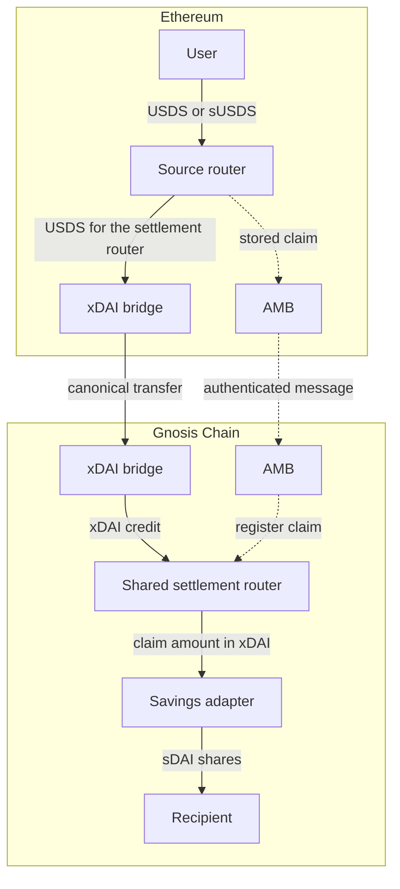
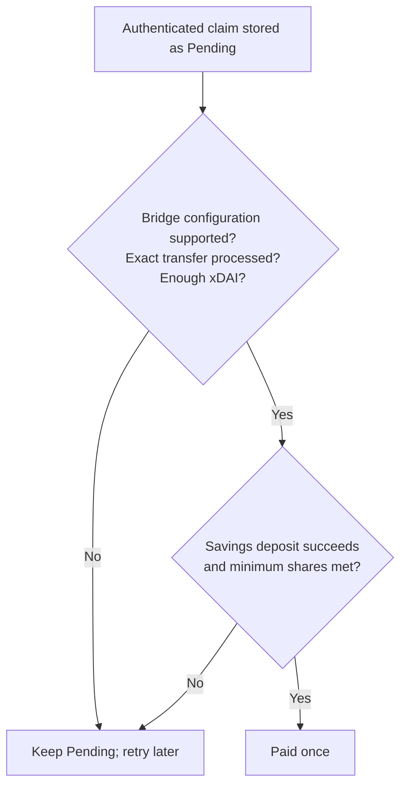

# How the AMB settlement router bridge works

A user approves USDS or sUSDS, then makes one Ethereum deposit transaction. The router
redeems sUSDS when needed, sends USDS through the existing xDAI bridge, and submits a
claim to AMB. Both calls happen in that transaction: if either source call fails, the
deposit reverts. Delivery on Gnosis happens later.

On Gnosis, one shared settlement router receives the claim and is the destination for xDAI. It
converts the claim amount to sDAI for the chosen recipient only after the exact bridge
transfer has executed and the settlement router has enough xDAI. An executor retries pending claims,
so the user normally makes no Gnosis transaction.

The Ethereum router and Gnosis settlement router are new application contracts and have not been deployed. The xDAI
bridge and AMB contracts are existing infrastructure; this design does not change them.

## Where the funds and claim go

Solid arrows show assets. Dotted arrows show a message or a call.

The two cross-chain paths can arrive in either order. AMB registers a claim; the
canonical bridge establishes whether its exact transfer executed. Native xDAI can reach
the settlement router later than that execution marker. A sponsor may supply cash for that gap, but
sponsor cash alone never authorizes a payout.

## What authorizes a payout

The settlement router first stores a valid AMB claim as Pending. It may try to settle immediately.
If that attempt fails, the claim stays Pending and anyone can retry it later.

The exact transfer check uses the settlement router address, claim amount and bridge nonce. A
validator signature count, a transfer to another address, or a large settlement router balance
cannot replace the processed marker. After it exists, the settlement router may use sponsor cash
before the bridge's native credit arrives. If cash is short, settlement does nothing
until more arrives. If the adapter fails or returns too few shares, that attempt reverts
without spending the claim's xDAI.

## Why the claim cannot be sent without a source deposit

The Ethereum router creates a new claim only after it:

1. Pulls the caller's USDS, or redeems the caller's approved sUSDS, and checks the USDS
   it actually received. Old router balances cannot count as this deposit.
2. Relays exactly that amount to the fixed settlement router address and checks the bridge nonce and
   token balance changes.
3. Stores the payer, recipient, amount, minimum shares and nonce, then sends that stored
   claim through AMB.

All three steps happen in one transaction. A source-side bridge limit, failed relay, or
failed AMB submission reverts them together. A later resend sends only the stored
message; it cannot move more funds, change the recipient or invent another bridge nonce.
The router starts deprecated. Its Ethereum bridge council Safe can resume deposits
after review or deprecate them again. A change to the Ethereum bridge proxy's
implementation blocks new deposits until the council reviews and acknowledges it.
All four new-deposit methods obey the gate. Existing claim resends and Gnosis
settlement remain available.

On Gnosis, the settlement router accepts registration only from its configured AMB when that AMB
identifies the configured Ethereum router and source chain. The settlement router derives the claim
ID from the router, both bridges, the settlement router and bridge nonce. The AMB delivery ID does
not determine the entitlement. Identical messages preserve the original claim, any
lowered minimum and the Paid state; a conflicting message is rejected.

This protection depends on honest configured AMB and bridge infrastructure. The
processed marker binds the settlement router, amount and nonce, **not** the payer or final sDAI
recipient. AMB authenticates those fields from the router's message. The settlement router does not
independently verify an Ethereum receipt. It also trusts the configured savings
adapter's report of shares issued. See
[security and ownership](AMB_ROUTER_SECURITY.md) for the full trust boundary.

The router records the actual Ethereum caller as payer. Its default methods make that
payer the Gnosis recipient; the “To” methods let the caller choose someone else. Whoever
calls settlement cannot change the recipient or amount. Only the recorded recipient can
lower the pending claim's minimum shares. A contract wallet at the same address on both
chains may have different owners, so users must choose the Gnosis recipient
deliberately.

## When something is delayed

- **The source transaction fails:** The relay and claim both roll back. The user retains
  the tokens or shares and may try again after the cause changes.
- **The source succeeds but Gnosis shows Unknown:** AMB registration may be delayed or
  may have failed. Anyone can call the source router's resendClaim with the stored claim
  ID. This sends another message, not another deposit.
- **The bridge transfer has not executed:** A destination-side limit or bridge delay
  keeps the claim Pending, even if AMB arrived and sponsor cash is available. If the
  transfer never executes, this version has no automatic refund.
- **The claim is Pending:** Check bridge execution, cash, adapter behavior and the
  recipient's minimum. The executor retries the same claim when conditions change. Paid
  claims do nothing on replay.
- **The bridge configuration changes:** Settlement stops if the current fee manager or
  decimal shift is unsupported. An implementation upgrade alone does not stop it;
  operators must review whether the upgraded bridge still preserves the transfer
  and processed-marker behavior the settlement router relies on.

The settlement router does not reserve cash per claim, pay partially, or enforce a strict queue. A
smaller ready claim may settle while a larger one waits. It needs no sponsor buffer;
optional sponsor deposits are permanent donations. There is no sponsor withdrawal,
cancellation or timeout refund. A same-address Ethereum receiver can hold a canonical
bridge return for manual Safe recovery. The executor pays its own transaction gas.

## What FCR changes

[Fast Confirmation Rule](https://docs.gnosischain.com/bridges/fast-confirmation-rule)
may shorten the time bridge validators wait for Ethereum confirmation. It
adds no proof to the settlement router and does not make AMB delivery, bridge execution and native
credit simultaneous. This design advances cash only after the exact transfer's processed
marker exists; it does not pay against an observed Ethereum transaction or a timer.

Live validator settings, message-lane timing, native-credit ordering and recovery from
bridge limits still need validation before use. The
[operations guide](AMB_ROUTER_OPERATIONS.md) covers those gates; the
[integration evidence](AMB_ROUTER_INTEGRATION.md) records what has actually been tested.
