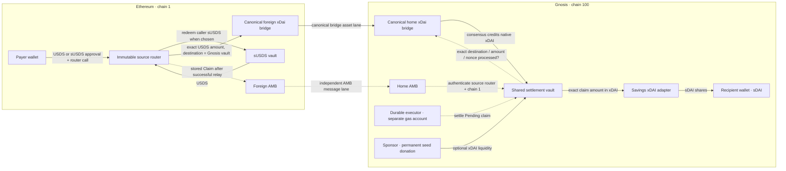
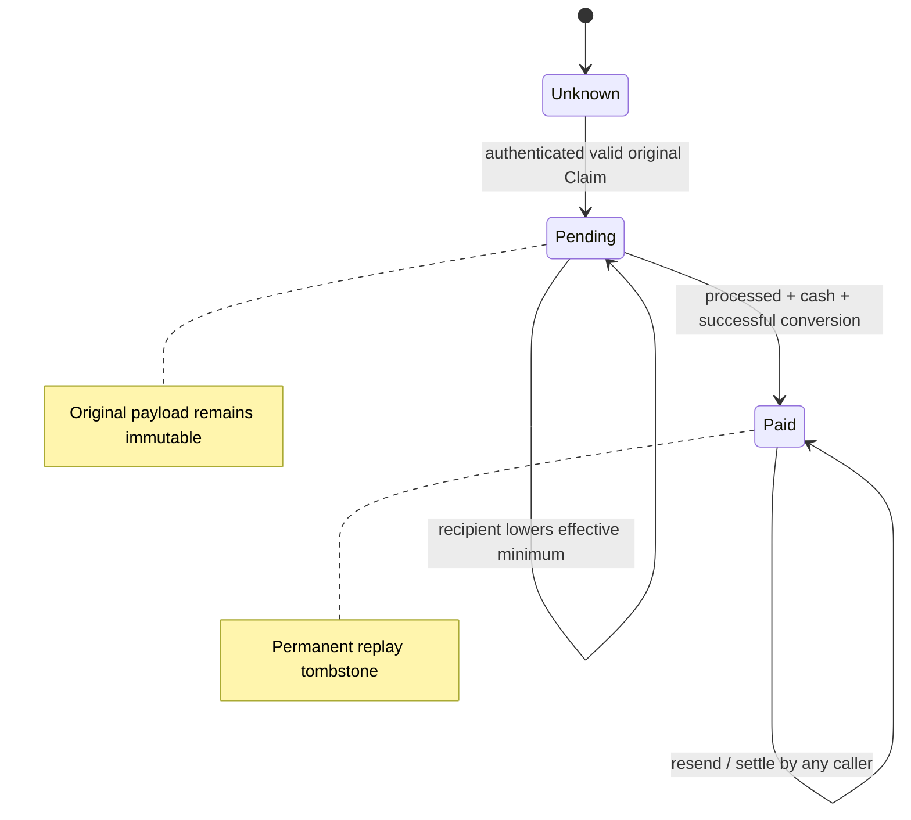

# FCR-assisted AMB settlement vault

Users approve USDS or sUSDS once, then make one Ethereum router transaction per
deposit. That transaction funds the canonical xDai bridge and submits an AMB
claim atomically. A shared Gnosis vault converts the corresponding xDAI into
sDAI for the authenticated recipient. A Gnosis executor completes pending work;
the user normally needs no Gnosis transaction or separate claim signature.

This architecture needs no change to either bridge. The router and settlement
vault have not been deployed.

## Architecture

Solid arrows carry assets; dotted arrows carry claims, checks or retry calls.



The source router, home bridge, foreign bridge, AMB endpoints and adapter are
fixed in constructor configuration. Neither router nor vault has an admin,
upgrade, arbitrary forwarding, sweep, timeout refund or recipient override.
The canonical bridges and AMBs retain their own validator/governance trust.
The [security and ownership guide](AMB_VAULT_SECURITY.md) lists each actor's
authority, dependency assumptions and consequences of failure.

## Funds and claim flow

```mermaid
sequenceDiagram
  actor P as Payer on Ethereum
  participant R as Source router
  participant F as Foreign xDai bridge
  participant FA as Foreign AMB
  participant H as Home xDai bridge
  participant HA as Home AMB
  participant V as Gnosis vault
  participant K as Gnosis executor
  participant A as Savings adapter
  actor B as Recipient
  P->>R: bridge or bridgeSavingsUSDS, amount/shares, minimum
  Note over P,FA: One atomic Ethereum transaction (after token approval)
  R->>R: transfer caller USDS or redeem caller sUSDS; measure USDS delta
  R->>F: relayTokens(fixed vault, exact USDS); capture bridge nonce
  R->>R: require exact token movement and nonce + 1; store immutable Claim
  R->>FA: requireToPassMessage(vault, registerClaim(Claim), 700k gas)
  Note over R,FA: Any failure rolls back redemption, relay and claim submission
  par Independent bridge delivery
    F-->>H: validator affirmation for vault, amount, nonce
    H->>H: mark exact transfer processed; schedule native mint
    H-->>V: consensus credit (no recipient call required)
  and Independent claim delivery
    FA-->>HA: relay authenticated source message
    HA->>V: registerClaim with source-router / source-chain context
    V->>V: durably store Pending; optional isolated settle attempt
  end
  V->>H: processed(keccak256(vault, gross amount, bridge nonce))?
  alt Processed and enough cash and adapter succeeds
    V->>V: mark Paid before external adapter call
    V->>A: depositXDAI{value: claim.amount}(stored recipient)
    A-->>B: sDAI
    V->>V: require positive shares >= effective minimum; emit ClaimPaid
  else Missing execution, cash, or conversion failed
    Note over V: Retain Pending; failed conversion rolls back its value and Paid state
    K->>V: settle(claimId) later, by any caller
    Note over K,V: Repeating Paid settlement is a no-op; caller cannot choose recipient
  end
```

If AMB arrives first, seed cash alone cannot authorize payment: the exact
canonical processed marker must exist. If bridge execution arrives first, the
claim still must come from the configured router through AMB. Native credit
alone creates no user entitlement and does not drive execution.

## Why an AMB request cannot invent an unfunded claim

The AMB channel authenticates **which contract sent the message**, rather than
proving arbitrary Ethereum receipts. The immutable source router exposes only
funded bridge entry points and replay of stored claims. A new claim is sent only
after this same transaction:

1. Transfers USDS from `msg.sender`, or redeems that caller's approved sUSDS into
   USDS. The observed balance increase must equal the reported/input assets.
   Pre-existing router USDS cannot be counted as this user's deposit.
2. Relays exactly those assets to the fixed Gnosis vault, with exact router/bridge
   token balance changes and exactly one foreign bridge nonce increment.
3. Stores the payer, recipient, assets, original minimum and captured nonce, and
   submits that payload to AMB. If AMB rejects it, the entire transaction reverts.

There is no method that accepts an arbitrary nonce or message for forwarding.
`resendClaim(id)` reads that original payload, so resending never bridges again
and never changes the entitlement. Changing an AMB delivery ID has no effect on
claim identity.

On Gnosis, the caller must be the configured home AMB, its authenticated source
sender must be this router and its source chain must be Ethereum. The vault
then derives the ID itself and checks the processed marker for **this vault,
this amount and this bridge nonce**. A signature count without its processed
bit, another recipient's transfer, an above-limit transfer that has not executed,
or an unrelated vault balance cannot replace that check.

Claim identity is:

```text
keccak256(abi.encode(
  keccak256("SDAI_AMB_VAULT_V1"), uint256(1), uint256(100),
  sourceRouter, foreignBridge, homeBridge, vault, bridgeNonce
))
```

The router records the actual Ethereum caller as `payer`. The default methods
also set `recipient = payer`; the `To` methods let that payer intentionally send
to another wallet. Gnosis settlement sends shares to the stored recipient, not
to whoever calls `settle`. Thus no separate same-wallet proof is required.
Contract wallets should explicitly choose their intended Gnosis address; equal
addresses across chains do not establish equal ownership of different contracts.

This guarantee assumes the configured AMB authenticates honestly and the
canonical bridge's processed marker has its tested semantics. It does not
withstand malicious bridge/AMB validators or governance. It is also not a
trustless Ethereum light-client proof.
The processed marker does not bind the payer or sDAI recipient; AMB authenticates
those fields. Actual issuance of returned shares is trusted to the adapter and
the savings protocol.

## Claim and retry states



Registration saves the claim before attempting conversion in a bounded 350k
gas self-call. It reserves 100k parent gas and allows for EIP-150 forwarding.
A reverting or gas-exhausting child cannot erase successful registration.
If the original AMB callback itself runs out of gas, registration is absent:
permissionlessly resend the source's stored claim on Ethereum. This is message
recovery, not another asset transfer.

The executor watches Gnosis registrations from the vault deployment block,
persists a hash-checked cursor and pending IDs, and submits one claim per
transaction. It persists the signed transaction/hash/nonce before broadcast;
ambiguous broadcasts and restarts rebroadcast that same transaction. Disk or
RPC failures retain work. Confirmation-based event replay handles cursor reorgs.
The vault remains the payment authority even if the executor is incorrect.

## What FCR changes, and what liquidity covers

[FCR](https://docs.gnosischain.com/bridges/fast-confirmation-rule) can shorten the
Ethereum confirmation wait used by enabled bridge validators. It makes this
one-user-transaction path more responsive and reduces the time capital sits
between source acceptance and destination execution. It supplies neither an
extra proof to the vault nor an atomic ordering guarantee between AMB and funds.
The selected validator lanes' FCR configuration is still a rollout gate.

This v1 waits for canonical execution before advancing sponsor cash. The buffer
covers the short gap between that execution marker and spendable native credit,
and temporary cash imbalance between concurrent claims. It does not advance
against a source transaction that has only been observed or against a timer.

| Example | Vault action |
| --- | --- |
| 10 xDAI claim, 100 cash, no processed marker | Wait for bridge; pay nothing |
| 10 xDAI claim, exact marker, 3 cash | Remain Pending; a settle call is a no-op |
| Same claim after another 7 xDAI credit | Convert exactly 10 xDAI; mark Paid |
| Same Paid claim delivered again | Keep Paid; pay nothing |
| Exact marker and cash, adapter fails | Keep Pending and all cash; retry later |

Cash is fungible; no partial payout or strict FIFO queue is imposed. Smaller
ready claims may complete while a larger claim waits. Seed is a permanent
sponsor donation in v1, with no withdrawal or LP accounting. Executor gas is
funded in its own account, outside this cash pool.

## Implementation and rollout

The [integration evidence](AMB_VAULT_INTEGRATION.md) pins the tested bridge
implementations. Runtime implementation/code-hash, zero incoming fee manager
and zero decimal shift checks fail closed. A legitimate canonical upgrade can
freeze Pending claims, and today's zero fee getter cannot establish historical
fees. Ethereum refund recovery and sponsor withdrawals are unsupported.

See [frontend integration](AMB_VAULT_FRONTEND.md) and
[deployment and operations](AMB_VAULT_OPERATIONS.md) before activation. Tests and
fork simulations support this implementation; live delivery ordering, validator
FCR mode and production recovery policy still require explicit decisions and a
separately authorized staging transfer.
