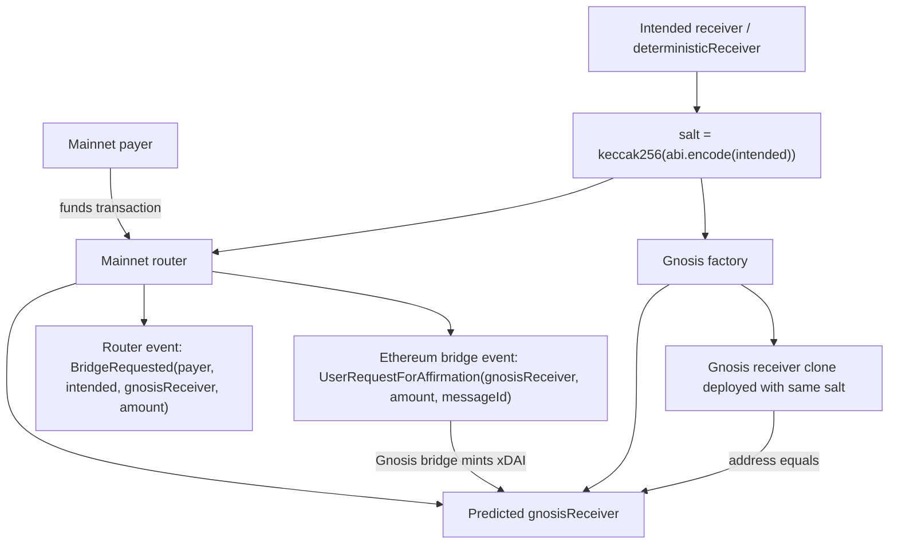
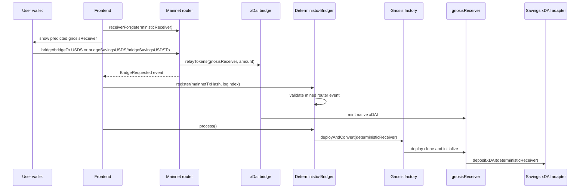
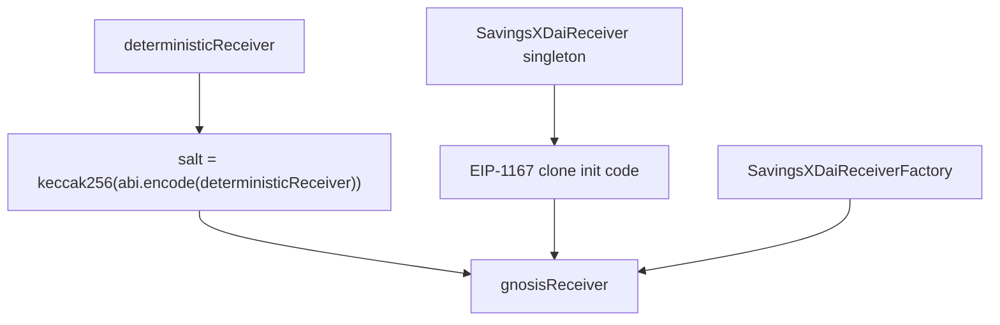

# Architecture

## Purpose

Deterministic Bridger routes hardcoded Ethereum USDS from a payer to a counterfactual Gnosis receiver derived from the intended `deterministicReceiver`. Users may also submit hardcoded Ethereum sUSDS; the router redeems it into USDS before using the canonical bridge. After the bridge mints native xDAI to that address, any executor can deploy the receiver clone and convert the full xDAI balance into sDAI for the same `deterministicReceiver`.

The design goal is deterministic payout without requiring the receiver contract to exist at bridge time.

## Current Deployments

| Network | Contract | Address |
| --- | --- | --- |
| Ethereum | `MainnetStablecoinBridgeRouter` | `0x634D45eFa4F053DD168648B15aD2A34Ec58852b0` |
| Ethereum | USDS token bridged by router | `0xdC035D45d973E3EC169d2276DDab16f1e407384F` |
| Ethereum | sUSDS token accepted by router | `0xa3931d71877C0E7a3148CB7Eb4463524FEc27fbD` |
| Ethereum | Canonical xDai bridge | `0x4aa42145Aa6Ebf72e164C9bBC74fbD3788045016` |
| Gnosis | `SavingsXDaiReceiver` singleton | `0x9C9790A9fcd56398a96a415439bEa1be6D6dcF99` |
| Gnosis | `SavingsXDaiReceiverFactory` | `0x0D53e8be621d280151B664c62A52EF4194bc5531` |
| Gnosis | Savings xDAI adapter | `0xD499b51fcFc66bd31248ef4b28d656d67E591A94` |

These deployments are the reference configuration for the architecture and the fork smoke tests. Sourcify reported exact matches for the router, singleton, and factory.

## System Flow

```mermaid
flowchart LR
  payer[Mainnet payer]
  intended[Intended receiver / deterministicReceiver]
  router[MainnetStablecoinBridgeRouter]
  bridge[Ethereum xDai bridge]
  receiver[Counterfactual gnosisReceiver]
  factory[SavingsXDaiReceiverFactory]
  adapter[Savings xDAI adapter]

  intended -->|salt input| router
  intended -->|salt input| factory
  payer -->|approve USDS or sUSDS| router
  router -->|redeem sUSDS when needed| router
  router -->|BridgeRequested includes intended + gnosisReceiver| bridge
  router -->|relayTokens(gnosisReceiver, amount)| bridge
  bridge -->|mints xDAI| receiver
  factory -->|deployAndConvert(intended)| receiver
  receiver -->|depositXDAI(deterministicReceiver)| adapter
  adapter -->|sDAI shares| intended
```

## Intended Receiver Path

The intended receiver is never inferred from the payer. For `bridgeTo` and
`bridgeSavingsUSDSTo`, the supplied `deterministicReceiver` is the salt input
that determines the Gnosis receiver and the eventual sDAI recipient.





## Components

- `MainnetStablecoinBridgeRouter` runs on Ethereum. It spends `msg.sender` allowance for hardcoded USDS, or spends hardcoded sUSDS and redeems it into USDS, derives the expected `gnosisReceiver`, approves the configured `foreignBridge`, and calls `relayTokens(address,uint256)`.
- `SavingsXDaiReceiverFactory` runs on Gnosis. It deploys EIP-1167 clones with `CREATE2`, emits both the deployed `gnosisReceiver` and bound `deterministicReceiver`, and can immediately convert the receiver balance after setup.
- `SavingsXDaiReceiver` is the singleton implementation behind every clone. Each clone stores exactly one `deterministicReceiver`, accepts native xDAI, deposits its full xDAI balance through `ISavingsXDaiAdapter.depositXDAI(deterministicReceiver)`, and can move accidental ERC-20 balances only to the same `deterministicReceiver`.
- `DeterministicReceiverLib` owns salt derivation, minimal proxy creation code, prediction, and deployment so the router and factory share one address-derivation path.
- The Tenderly `Deterministic-Bridger` Action validates mined router `BridgeRequested` events when the frontend calls its public webhook, then processes pending deterministic receivers only while the frontend pings it.
- `script/watchtower.mjs` remains a standalone polling utility that can submit `deployAndConvert(deterministicReceiver)` on Gnosis.

## Payer vs Receiver

The mainnet payer is the account whose token allowance and balance are spent by the router. The `deterministicReceiver` is the address used to derive the Gnosis receiver and to receive sDAI shares from the adapter.

- `bridge(amount)` uses `msg.sender` as both payer and `deterministicReceiver`.
- `bridgeTo(deterministicReceiver, amount)` still spends `msg.sender` allowance, but derives the receiver from the supplied `deterministicReceiver`.
- `bridgeSavingsUSDS(shares)` and `bridgeSavingsUSDSTo(deterministicReceiver, shares)` follow the same receiver rules, but spend sUSDS shares and emit `BridgeRequested` with the redeemed USDS amount.

This separation lets one payer fund a receiver address without changing the deterministic address derivation.

## Address Derivation



The invariant is:

```text
gnosisReceiver = CREATE2(factory, salt(deterministicReceiver), clone(singleton))
```

Both `MainnetStablecoinBridgeRouter.receiverFor(address)` and `SavingsXDaiReceiverFactory.predict(address)` use `DeterministicReceiverLib`. Predictions and deployments cannot drift unless deployment configuration changes.

## Invariants

- `deterministicReceiver` is the only input that decides the eventual payout identity.
- `gnosisReceiver` is always the CREATE2 address for the configured factory, singleton, and salt.
- The router does not custody assets beyond a single transaction. It either forwards caller USDS or redeems caller sUSDS into USDS, then approves and forwards the USDS to the bridge.
- The router clears bridge allowance before and after each relay so successful calls do not leave residual USDS approval on the router.
- The receiver clone never pays out to an arbitrary address. xDAI and accidental ERC-20 balances are always forwarded to the bound `deterministicReceiver`.
- Conversion is retriable. If adapter deposit fails, xDAI stays in the receiver for a later attempt.
- There is no admin sweep, pause, upgrade, or rescue path in the MVP.

## Deployment Order

1. Configure `.env` from `.env.example`.
2. Install ignored Foundry dependencies with `npm run install:foundry`.
3. Deploy and Sourcify-verify `SavingsXDaiReceiver` and `SavingsXDaiReceiverFactory` on Gnosis with `npm run deploy:gnosis`.
4. Deploy and Sourcify-verify `MainnetStablecoinBridgeRouter` on Ethereum with `npm run deploy:mainnet`.
5. Run fork smoke checks against the exact deployment configuration.
6. Deploy the Tenderly `Deterministic-Bridger` Action, configure its webhook in the frontend, and disable or delete older prefixed Actions if they exist.

## Trust Boundaries

- Users trust hardcoded Ethereum USDS, hardcoded Ethereum sUSDS, and the configured foreign bridge pair to be compatible.
- Users trust the configured foreign bridge to pull the token and bridge the intended amount.
- Users trust the Gnosis factory and singleton addresses embedded in the router deployment.
- Users trust the configured Savings xDAI adapter in the singleton deployment.
- The watchtower is not trusted with funds. The Tenderly Action validates fresh mined mainnet router logs before storing work, and anyone can call `deploy`, `convertToSavingsXDai`, `moveERC20ToReceiver`, or `deployAndConvert`.
- The Tenderly webhook is public for browser use. Public callers can trigger bounded work and logs, but cannot choose a payout address or register arbitrary receivers without a fresh router event.
- ERC-20 recovery is permissionless and always sends to the bound `deterministicReceiver`.

## Operational Model

The public automation path is intentionally narrow:

1. The frontend predicts the `gnosisReceiver` from `deterministicReceiver`.
2. The user bridges through the mainnet router.
3. The public webhook validates the mined router event and records work only for that receiver.
4. Any executor can finish by deploying and converting the receiver once xDAI is present.

The architecture tolerates delayed execution. The receiver can be deployed before or after xDAI arrives, and conversion can be retried until the adapter succeeds.

## Pre-Deployment Fork Checks

Run:

```bash
MAINNET_RPC_URL=$MAINNET_RPC_URL GNOSIS_RPC_URL=$GNOSIS_RPC_URL forge test --match-contract ForkSmokeTest
```

The fork smoke tests prove:

- The Ethereum bridge proxy has code.
- The Ethereum bridge implementation exposes `relayTokens(address,uint256)`.
- The Gnosis xDAI bridge and sDAI token have code.
- `SAVINGS_XDAI_ADAPTER`, when set, has code on Gnosis.

The Ethereum bridge can be upgradeable. Re-run fork checks immediately before deployment and after any bridge upgrade.
