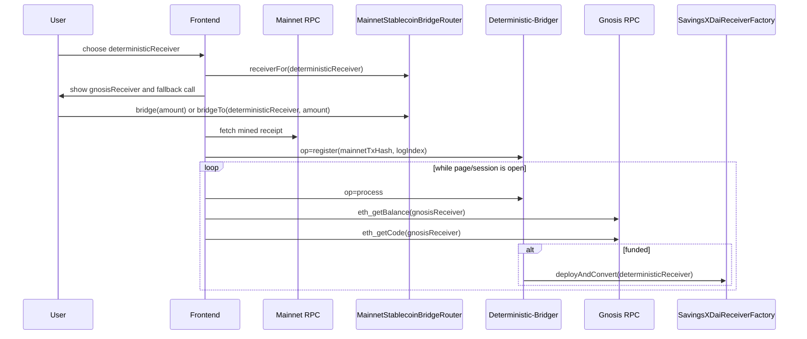
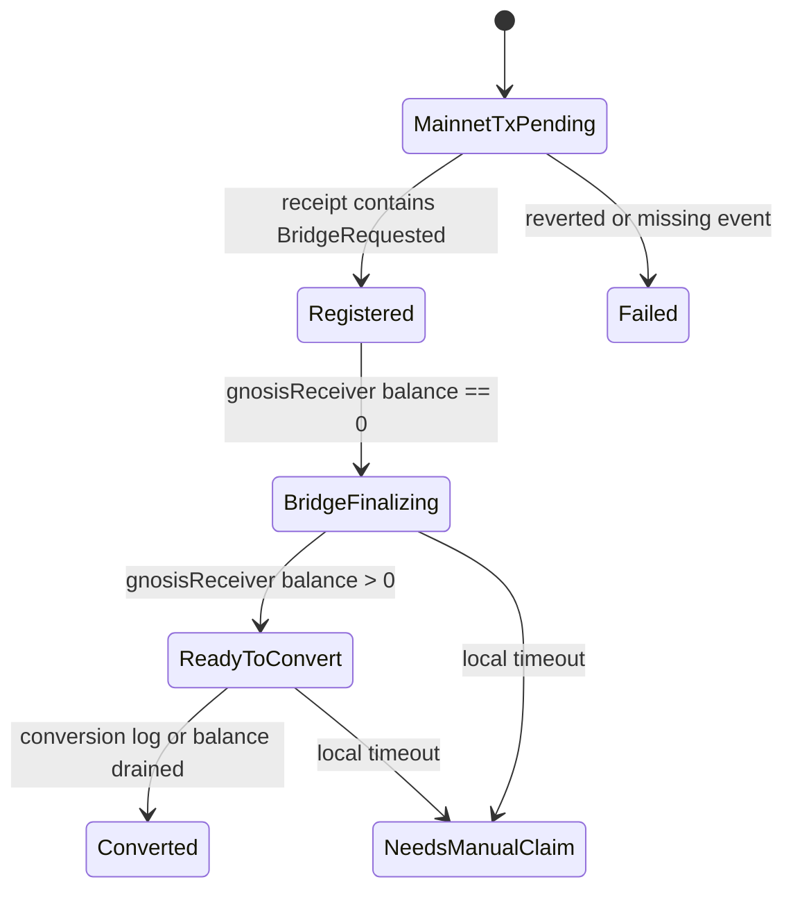

# Frontend Integration

This doc covers the browser-side flow for deterministic bridging.
For the Tenderly Action contract, webhook ops, storage state, secrets, and
validation, see [Tenderly Actions Watchtower](./TENDERLY_ACTIONS.md).

## Runtime Config

The frontend needs public chain and contract configuration, plus the public
Tenderly webhook URL:

| Key | Network | Purpose |
| --- | --- | --- |
| `ROUTER` | Ethereum | `MainnetStablecoinBridgeRouter` used for `receiverFor`, `bridge`, and `bridgeTo`. |
| `MAINNET_TOKEN` | Ethereum | Token the user approves and bridges through the router. |
| `SAVINGS_XDAI_RECEIVER_FACTORY` | Gnosis | Factory used for manual fallback and independent prediction checks. |
| `GNOSIS_SINGLETON` | Gnosis | Singleton used by TypeScript `CREATE2` prediction if not reading `receiverFor`. |
| `TENDERLY_DETERMINISTIC_BRIDGER_WEBHOOK_URL` | Web | Public Tenderly Action webhook. |
| Ethereum RPC client | Ethereum | Reads transaction receipts and router events. |
| Gnosis RPC client | Gnosis | Reads receiver balance, code, and conversion logs. |

Do not ship Tenderly API keys, executor private keys, or authenticated private
RPC URLs to browser code. The webhook URL is public by design; the Action must
remain safe because of validation, not because the URL is hidden.

## Browser Flow



## Data Model

Track each local bridge attempt independently. A minimal browser-side record is:

```ts
type ActiveBridge = {
  deterministicReceiver: `0x${string}`;
  gnosisReceiver: `0x${string}`;
  amount: bigint;
  mainnetTxHash?: `0x${string}`;
  bridgeLogIndex?: number;
  sawPositiveGnosisBalance: boolean;
  registeredAt?: number;
  lastProcessPingAt?: number;
};
```

Persist this locally if the app supports reload recovery. The Action is not a
durable frontend session store; it only keeps pending conversion jobs.

## UI Integration Rules

1. Derive `deterministicReceiver` before the user signs.
2. Compute and display `gnosisReceiver` with
   `router.receiverFor(deterministicReceiver)` or the matching TypeScript
   `CREATE2` implementation.
3. Show the manual fallback call:
   `factory.deployAndConvert(deterministicReceiver)`.
4. Call `router.bridge(amount)` when payer and receiver are the same.
5. Call `router.bridgeTo(deterministicReceiver, amount)` when funds are sent to
   another deterministic receiver.
6. Track the Ethereum transaction hash locally after submission.
7. Do not call Tenderly until the receipt is mined and a `BridgeRequested` log
   is present.
8. If the receipt has more than one router `BridgeRequested` log, the frontend
   may call `op=register` once without `logIndex`; the Action validates and
   tracks every router event separately.
9. Recompute `gnosisReceiver` on reload or page restoration.
10. Resume `op=process` only while the page/session has active bridges.

## Receipt Parsing

After the Ethereum transaction is mined, parse every router
`BridgeRequested(address,address,address,uint256)` log in the receipt.

- If no router event exists, do not call Tenderly; show a failed bridge state.
- If exactly one event exists, call `op=register`; including that event's
  `logIndex` is optional.
- If multiple events exist, call `op=register` once without `logIndex` to
  register every validated router event, or call it per event with `logIndex` if
  the UI wants narrower local control.
- Track the local bridge attempt by matching `deterministicReceiver`,
  `gnosisReceiver`, and `bridgeLogIndex`.
- Verify the event `gnosisReceiver` matches the value shown before signing.

## Reload Behavior

- If the transaction hash is known, re-read the mined receipt.
- Re-call `op=register` when needed; the Action dedupes each job by
  `gnosisReceiver.toLowerCase()` and keeps the source `logIndex`.
- Resume `op=process` pings after restoration.
- If the receipt is missing, reverted, or does not contain the router event,
  show failure and stop the automation path.

## Polling Guidance

- Call `op=process` every 40-150 seconds while the page is active.
- Poll Gnosis for `eth_getBalance(gnosisReceiver)` and
  `eth_getCode(gnosisReceiver)`.
- Inspect `ConvertedToSavingsXDai` logs when you need stronger confirmation
  than a balance/code check.
- Stop polling once there are no local active bridges left.

Use jitter in the polling interval so many clients do not ping the public Action
at the same time after a common UI event.

## Status Rules



- `mainnet tx pending`: waiting for the Ethereum receipt.
- `registered / bridge finalizing`: the receipt was registered and
  `gnosisReceiver` still has zero xDAI.
- `ready to convert`: `gnosisReceiver` has a positive xDAI balance.
- `converted`: receiver code exists and a `ConvertedToSavingsXDai` log is found,
  or xDAI balance returns to zero after previously being positive.
- `needs manual claim`: automation has not resolved the job within the local
  timeout window; show `factory.deployAndConvert(deterministicReceiver)`.

## Operational Notes

- Keep the real public webhook URL out of source-controlled UI config examples.
- Never ship Tenderly API keys or executor private keys to the browser.
- The frontend should treat the Action as a lightweight, public background
  helper, not as a durable job runner.
- Use the UI to surface the derived receiver, bridge status, and manual fallback
  path clearly enough that the user can recover if browser automation stops.
- On timeout, keep showing the deterministic receiver and Gnosis receiver so the
  user can verify the fallback transaction destination before signing.
