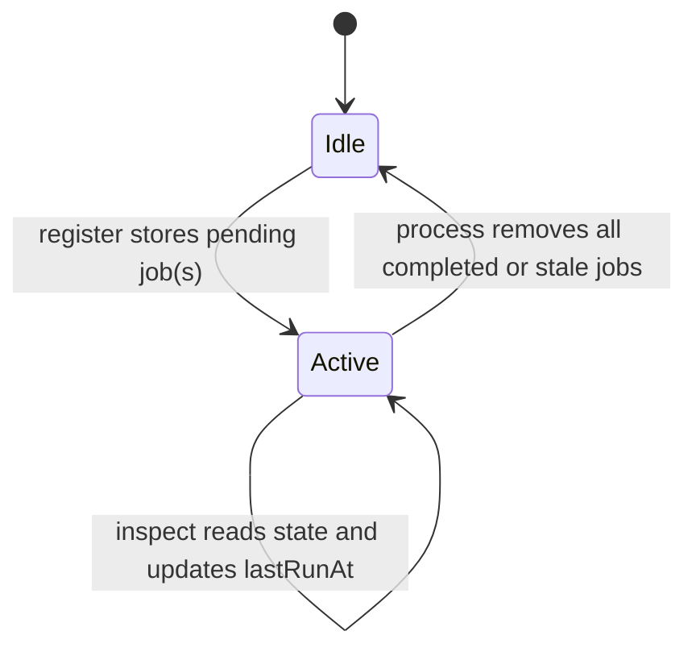

# Tenderly Actions Watchtower

`Deterministic-Bridger` is the single Tenderly Web3 Action used by this repo.
It is intentionally idle unless the browser calls it:

- no block trigger
- no periodic trigger inside Tenderly
- no polling loop inside Tenderly

See [Frontend Integration](./FRONTEND_INTEGRATION.md) for the browser-side
flow, status rules, reload behavior, polling cadence, and manual fallback UX.

## System Overview

```mermaid
flowchart LR
  ui[Browser frontend]
  mainnet[Ethereum RPC]
  router[MainnetStablecoinBridgeRouter]
  action[Deterministic-Bridger]
  storage[Tenderly Storage]
  gnosis[Gnosis RPC]
  factory[SavingsXDaiReceiverFactory]

  ui -->|register / process / inspect| action
  ui -->|read receipt| mainnet
  ui -->|receiverFor(deterministicReceiver)| router
  action --> storage
  action -->|predict / deployAndConvert| factory
  action --> gnosis
  router -->|BridgeRequested| ui
```

## Public Webhook

The webhook is public on purpose. The frontend must call it directly from the
browser, so Tenderly API credentials cannot live in client code.

Security is preserved by pushing trust into on-chain and RPC checks:

- `op=register` only accepts a mined Ethereum transaction receipt.
- The receipt must contain a `BridgeRequested` log from the configured router.
- `gnosisReceiver` must match `factory.predict(deterministicReceiver)`.
- `op=process` only works on stored jobs and only calls
  `deployAndConvert(deterministicReceiver)`, which is permissionless.
- The stored job binds `deterministicReceiver` to the eventual payout path, so
  callers cannot redirect funds with a forged payload.

Do not put Tenderly API keys, private keys, or real webhook URLs in frontend
code or in this document.

## Action State

Tenderly Storage keeps one JSON object under
`sdai-receiver-watchtower:state`.

Canonical shape:

```json
{
  "status": "idle",
  "pending": [],
  "updatedAt": 0,
  "lastRunAt": 0
}
```

Notes:

- `status` is effectively derived from `pending`: empty means `idle`, non-empty
  means `active`.
- `updatedAt` changes whenever the Action writes state.
- `lastRunAt` records the last time `op=process` or `op=inspect` touched state.
- `pending` stores only unfinished jobs; completed work is not kept as history
  in Tenderly.

State lifecycle:



## Webhook Payloads

Register a mined bridge transaction:

```json
{
  "op": "register",
  "mainnetTxHash": "0x...",
  "logIndex": 123
}
```

- `mainnetTxHash` is required.
- `logIndex` is optional.
- When `logIndex` is present, only that exact `BridgeRequested` log is
  registered.
- When `logIndex` is omitted, every router `BridgeRequested` log in the
  transaction is validated and registered.
- Multi-event receipts are expanded into one pending job per
  `gnosisReceiver`, and each job stores the event `logIndex` for tracking.

Process the queue:

```json
{
  "op": "process"
}
```

Inspect storage:

```json
{
  "op": "inspect"
}
```

## Register Validation

`op=register` does not trust caller-supplied receiver data. It:

1. Fetches the Ethereum receipt through `MAINNET_RPC_URL`.
2. Rejects missing, reverted, unrelated, malformed, or stale receipts.
3. Requires a `BridgeRequested` log emitted by the configured `ROUTER`.
4. Reads `payer`, `deterministicReceiver`, `gnosisReceiver`, and `amount` from
   the log.
5. Verifies `factory.predict(deterministicReceiver) == gnosisReceiver`.
6. Stores or refreshes each job keyed by `gnosisReceiver.toLowerCase()`, with
   the source event `logIndex`.

Stored job shape:

```json
{
  "id": "0x...",
  "deterministicReceiver": "0x...",
  "gnosisReceiver": "0x...",
  "mainnetTxHash": "0x...",
  "logIndex": 123,
  "amount": "1000000000000000000",
  "payer": "0x...",
  "registeredAt": 0,
  "updatedAt": 0,
  "attempts": 0,
  "lastCheckedAt": null,
  "lastError": null
}
```

Re-registering the same `gnosisReceiver` refreshes the stored job instead of
duplicating it.

## Process Lifecycle

Each `op=process` run:

1. Loads Tenderly Storage state.
2. Drops jobs older than `WATCHTOWER_MAX_AGE_SECONDS`.
3. Checks up to `WATCHTOWER_BATCH_SIZE` jobs in one call.
4. Keeps a job pending while `eth_getBalance(gnosisReceiver) == 0`.
5. Calls `deployAndConvert(deterministicReceiver)` once the receiver is funded.
6. Removes the job after a successful conversion transaction.
7. Keeps the job pending and records `lastError` after revert or RPC failure.

If `pending` becomes empty, the Action writes `status: "idle"` and stops until
the browser or another caller invokes it again.

## Secrets and Config

Set these Tenderly Action secrets:

```text
MAINNET_RPC_URL=<Ethereum RPC URL used to read mined receipts>
TENDERLY_GNOSIS_RPC_URL=<Tenderly Virtual Environment, fork, or Gnosis RPC URL>
GNOSIS_RPC_URL=<fallback Gnosis RPC URL when TENDERLY_GNOSIS_RPC_URL is unset>
ROUTER=0x634D45eFa4F053DD168648B15aD2A34Ec58852b0
SAVINGS_XDAI_RECEIVER_FACTORY=<SavingsXDaiReceiverFactory on Gnosis>
WATCHTOWER_PRIVATE_KEY=<funded executor private key>
WATCHTOWER_BATCH_SIZE=25
WATCHTOWER_MAX_AGE_SECONDS=604800
```

`WATCHTOWER_PRIVATE_KEY` should be a dedicated low-balance executor key, not
the deployment key.

For fork or VNet tests, set `TENDERLY_GNOSIS_RPC_URL` to the Tenderly
environment. For production, point it at Gnosis or omit it and use
`GNOSIS_RPC_URL`.

## Operational Notes

- Keep `WATCHTOWER_BATCH_SIZE` small so public `op=process` calls stay cheap.
- Keep `WATCHTOWER_MAX_AGE_SECONDS` aligned with the maximum bridge-finalization
  window you want to support.
- Do not expose authenticated RPC URLs, Tenderly API keys, or executor private
  keys in browser code.
- The Action is permissionless but not a funds custodian; it only executes the
  public conversion path for validated jobs.
- If `op=process` fails, the job stays pending and `lastError` is updated.
- If `op=inspect` is called, it refreshes `lastRunAt` and reports the current
  storage snapshot without mutating pending jobs.

## Validation

Local checks:

```bash
node --check actions/receiverQueue.js
node --test actions/test/*.test.js
tenderly actions validate
tenderly actions build
forge fmt --check
forge build
forge test
```

The Action test suite uses deployed addresses from `.env`. It mocks Tenderly
storage/secrets and mainnet receipts for deterministic registration cases, reads
the live deployed mainnet router and Gnosis factory for wiring checks, and uses
an Anvil fork of Gnosis to test funded receiver conversion without mutating
production state.

Tenderly VM smoke:

1. Register a mined or simulated valid bridge receipt.
2. Fund the predicted receiver with `tenderly_setBalance`.
3. Run `{ "op": "process" }`.
4. Verify the receiver clone exists, receiver xDAI balance is zero, and
   `pending` is empty.
